  <a href="https://github.com/angelabenavente">EN</a> /
  ES /
  <a href="https://github.com/angelabenavente/angelabenavente_fr#readme">FR</a>

<h1 align="left">
  
  Hola, soy Ángela Benavente (Elabezan)
</h1>

  Soy ingeniera de software senior, especializada en frontend y producto. Me gusta unir creatividad y datos para crear herramientas útiles.

   Me interesan especialmente la accesibilidad y la seguridad. Comparto lo que voy aprendiendo sobre estos y otros temas en
  <a href="https://www.elabezan.com/">mi blog</a>.

  Abierta a colaboraciones interesantes y mentoría :)

---

  

  Hecho con <a href="https://github.com/angelabenavente/github-profile-sh">github-profile.sh</a> &lt;3

---

## 🛠️ Stack y herramientas

<table>
  <tr>
    <th align="left">Categoría</th>
    <th align="left">Tecnologías y prácticas</th>
  </tr>

  <tr>
    <td><b>Lenguajes</b></td>
    <td>
      
      
      
      
    </td>
  </tr>

  <tr>
    <td><b>Web</b></td>
    <td>
      
      
      
    </td>
  </tr>

  <tr>
    <td><b>Móvil</b></td>
    <td>
      
      
    </td>
  </tr>

  <tr>
    <td><b>Estilos</b></td>
    <td>
      
      
      
      
      
    </td>
  </tr>

  <tr>
    <td><b>Gestión de estado</b></td>
    <td>
      
      
    </td>
  </tr>

  <tr>
    <td><b>Testing</b></td>
    <td>
      
      
    </td>
  </tr>

  <tr>
    <td><b>Accesibilidad</b></td>
    <td>
      
      
      
    </td>
  </tr>

  <tr>
    <td><b>Seguridad</b></td>
    <td>
      
      
    </td>
  </tr>

  <tr>
    <td><b>Backend y APIs</b></td>
    <td>
      
      
      
    </td>
  </tr>

  <tr>
    <td><b>Cloud y CI/CD</b></td>
    <td>
      
      
      
      
      
    </td>
  </tr>

  <tr>
    <td><b>CMS</b></td>
    <td>
      
      
      
    </td>
  </tr>

  <tr>
    <td><b>Herramientas</b></td>
    <td>
      
      
      
      
      
      
      
      
      
    </td>
  </tr>
</table>
